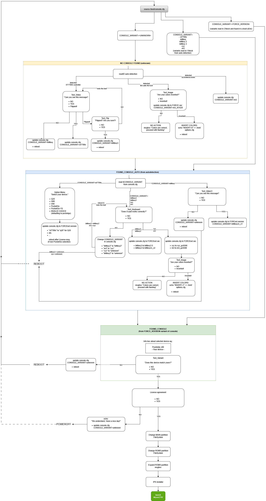

# Buildroot Package for Miyoo CFW 2.0.0
Opensource development package for Miyoo handhelds.

## Install

It is assumed you're using Debian based distro, others like Arch or Fedora may brake at build time.

### Install necessary packages

``` shell
sudo apt install -y wget unzip build-essential git bc swig libncurses-dev libpython3-dev libssl-dev cpio rsync subversion python3 mercurial imagemagick btrfs-progs
```

### Download BSP

```shell
git clone https://github.com/MiyooCFW/buildroot
```

## Make the first build

### Apply defconfig uClibc

```shell
cd buildroot
make miyoo_uclibc_defconfig
```

### Or apply defconfig musl

```shell
cd buildroot
make miyoo_musl_defconfig
```

### Regular build

- image

```shell
make
```

- image & sdk

```shell
make sdk
```

### Minimal build

- image (mininal)

```shell
support/kconfig/merge_config.sh configs/miyoo_uclibc_defconfig \
board/miyoo/minconfig/min-pkgs-fragment.config board/miyoo/minconfig/rootfs-size-fragment.config
make MINIMAL="YES"
```

NOTE: `merge_config.sh` allows up to 2 extra fragment configs.

## Speed up build progress

### Compile speed

If you have a multicore CPU, you can try
```
make -j ${YOUR_CPU_COUNT}
```
or buy a powerful PC for yourself.

## Flashing firmware to target

load output/images/miyoo-cfw-*.img on sdcard

## First booting device

You will have to answer a few questions on first boot, represented on graphic below:


---
# _Buildroot 2022.02.9 (docs: https://github.com/MiyooCFW/buildroot/blob/master/docs/manual/manual.pdf)_
---
